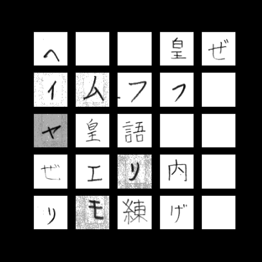

# Japanese Character Image Classification

Author: Chaz Frazer<br>

# Overview
This project is designed to take image recognition of Japanese characters, and create a learning model that can classify the characters based on the read input.<br>

The project looks to accurately predict across the three main Japanese language writing systems (Kanji, Hiragana, Katakana) - used in Japan for over a thousand years since the 8th century.<br>

The data is from the ETL Character Database, which includes over a billion total of Japanese characters hand-written and reorganized by the National Institute of Advanced Industrial Science and Technology (AIST).<br><br>


# Business Problem
Can a viable product model be created to accurately transcribe, read, and identify Japanese text for the archiving of important literary works? This can be used to preserve the surviving texts of endangered languages from the Ainu and Ryukyu minority groups in Japan.<br>

Can this be expanded to create an accurate API that recognizes written Japanese characters for touchscreen devices (ie. dictionaries, translation apps). Target audience is Japanese and English research orgs, higher learning institutions, linguistic preservation societies, and language students.
<br><br>


# The Writing Systems of Japan
<b>Kanji:</b><br>
Kanji entered Japan in the 8th century via Chinese monks who also brought other traditions with them such as tea and Buddhism. Kanji is based on comparable Chinese characters that convey meaning from pictographic images.<br>

<b>Hiragana:</b><br>
Phonetic writing system taking the mostly curviture root aspects of some kanji characters to represent a phonetic representation of sounds. There are 46 individual hiragana characters used today (alongside 29 diphthongs).

<b>Katakana:</b><br>
Much like hiragana, katakana is phonetically identical to hiragana. Katakana takes the angular aspects of some kanji characters and is mainly used for foreign words, onamatepeia, and sounds. Katakana contains the same amound of phonetic characters as hiragana.

<b>Kuzushiji:</b><br>
A cursive writing style, over 3 million books, on a diverse array of topics such as literature, science, mathematics and cooking written in kuzushiji are preserved today. However, the standardization of Japanese textbooks known as the “Elementary School Order” in 1900, removed Kuzushiji from regular school curriculum, as modern japanese print became popular. As a result, most Japanese natives today cannot read books written or printed in kuzushiji just 120 years ago.<br><br>


# Data
The data is from the National Institute of Advanced Industrial Science and Technology (AIST) and was reorganized by the Japan Electronics and Information Technology Industries Association. There are about 1.2 million handwritten Japanese records written by tens of thousands of individuals including numerals, hiragana, katakana, and kanji. Collected from 1973 to 1984, the data was sent to AIST by submission of magnetic tapes and CD-R delivered by post.<br>

Each file contains 5 data sets except ETL8G_33.<br>
Each data set contains 956 characters written by a writer.<br>
Each writer wrote 10 sheets (genkouyoushi) per data set.<br>

<b>Hiragana (ETL 8):</b><br>
71 hiragana characters (46 unique + 29 diphthongs)<br>
160 writers<br>
8199 records (genkouyoushi sheets)<br>
1,254,120,000 unique handwritten hiragana characters (shared with kanji chars in the same files)<br>

<b>Kanji (ETL 8):</b><br>
883 daily use kanji<br>
160 writers<br>
8199 records<br>
152,878,411 unique handwritten kanji (shared with hiragana chars in the same files)<br>

<b>Katakana (ETL 1):</b><br>
46 katakana characters (46 unique, dipthongs not included as they are phonetically identical to hiragana)<br>
1411 writers<br>
2052 records<br>
2,436,366 unique handwritten katakana characters<br><br>

    
# Data Cleaning & EDA
The data was read in from binary, sorted and then saved to an npz file for further access and to model upon. The separate datasets were then merged into one to represent the full scope of the Japanese language. Once done and training labels were created, the data images were able to be rendered for inspection. <br>
<br><br>
    

# Feature Engineering
The data was resized to 64x64 pixels for our CNN model to read over. A Tensorflow's ImageDataGenerator filter was put over the images at random to create variability in our data to reduce the chance of our model overfitting.<br><br>


# Modeling & Results
After our EDA and feature engineering we were ready to begin our modeling the process.<br>
The data was trained on KNN and Random Forest shallow algorithms initially, and then a CNN and cuDNN model in the cloud using AWS' EC2 instance package. Environment was run in virtual machine using g4dn Nvidia Tesla GPU architecture.<br>
Pre-merge our dataset sizes for modeling were:
* Hiragana: 11,360 image classes 
* Kanji: 139,680 images classes
* Katakana: 64,906 images classes<br>

After the merge, we had 214,946 images across 3 classes<br>

#### Initial Class Imbalance<br>
<br><br>
    

After modeling each writing system, and experimenting with various parameters and hyperparameters, our results were as below:<br>
|Model         |Description                          |Train Accuracy |Train Loss      |Validation Accuracy |Validation Loss |Test Accuracy |Test Loss |
|:-------------|:------------------------------------|:--------------|:---------------|:-------------------|:---------------|:-------------|:---------|
|KNN           |n_neighbors=10, weights='distance'   |92.67%         |N/A             |92.75%              |N/A             |95.95%        |N/A       |
|Random Forest |class_weight='balanced', max_depth=32|94.50%         |N/A             |94.48%              |N/A             |94.95%        |N/A       |
|CNN           |12 layers, 8,491,555 parameters      |99.79%         |0.68%           |99.40%              |3.2%            |99.73%        |0.90%     |
|cuDNN (Nvidia)|8 layers, 264,195 parameters         |99.95%         |0.017%          |99.55%              |0.027%          |99.48%        |0.019%    |

#### Best Performing Model Architecture<br>
<br><br>

    
# Next Steps
* Work with kuzushiji (Japanese cursive writing) KMINST dataset variations
* OpenCV for live model image recognition using webcam
* Expand model for touchscreen handwriting API integration for language education (iOS app)
* The CUNY Endangered Language Initiative strives to preserve our dying languages around the world. Use model as a way to utilize computational linguistics and preserve precious texts and early written Japanese history<br><br>
    

# References
* ELTCDB Data Set -- http://etlcdb.db.aist.go.jp/<br>
* AIST -- http://www.aist.go.jp/index_e.html <br>
* JEITA -- http://www.jeita.or.jp/english/<br><br>

    
# Repository Structure
```
├── data
├── img
├── logs
├── models
├── sub_functions    
├── trials
├── .gitignore
├── README.md
├── japanese_classification.ipynb
├── japanese_models.ipynb    
└── mvp_presentation.pdf